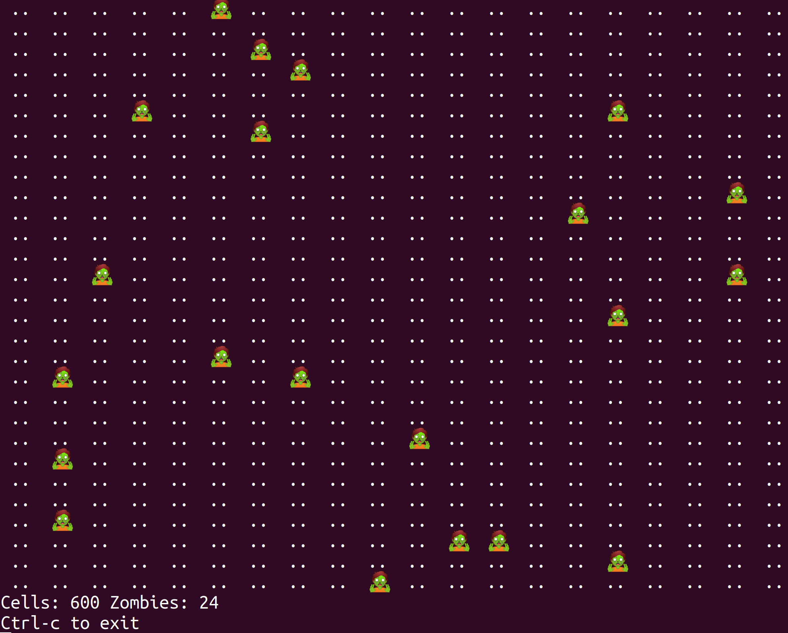

# DDD aggregates & zombies



Why this repo? I think there are two main sources to learn about DDD agregates or at least those were the sources where I got a better understanding about aggregates from. In both cases the authors use an example with database and transactions. I wonder if:

 * DDD aggregates design makes sense without persisting objects. I mean, can we use the same design principles to keep consistency only having objects in memory?
 * Can I came up with a simpler sample to explain DDD agregates without using databases?

 I decided to write this small sample to learn more about DDD aggregates. I think the problem they solve it's a generic concurrency problem, in the sense of having 2 entities trying to update a shared state in a context where race conditions can happen. My idea was:

 1. First, try to reproduce such scenario where I have a domain invariant and 2 objects updating a shared state.
 2. Second, try to find out if what I learnt from both articles also apply only to objects in memory and if I can keep domain invariant designing the rigth aggregates.
 3. Finally, if they also apply, try to explain the example step by step in order to have the most simple possible example about DDD aggregates (withput involving databases).

 Althougth the sample is finished the resoning about this topic (or learning) is a WIP. I would like to write the:

 [Full explanation about this example](doc/ddd-agregates.md)

## Requirements

* Node 14.17.0
* Docker 20.10.5

## Run

With docker:
```
docker run --rm -it josecelano/ddd-aggregates-and-zombies
```

Dockerhub image: https://hub.docker.com/r/josecelano/ddd-aggregates-and-zombies

You can also install the project (clone, build and run).

## Install

From repo:
```
git clone git@github.com:josecelano/ddd-aggregates-and-zombies.git
./bin/docker/build.sh
./bin/docker/run.sh
```

## Development

Build docker image:
```
./bin/docker/build.sh
```

Run app with concurrency problem:
```
./bin/docker/run.sh
```

After some seconds you will get this error:
```
/usr/src/app/lib/apocalyptic_world.js:83
      throw new RangeError(`The cell ${coordinate.toString()} is already occupied by another zombie`);
      ^

RangeError: The cell (7,17) is already occupied by another zombie
    at ApocalypticWorld.guardThatCellIsNotMarkedAsOccupiedTwice (/usr/src/app/lib/apocalyptic_world.js:83:13)
    at ApocalypticWorld.markCellAsOccupiedByAZombie (/usr/src/app/lib/apocalyptic_world.js:51:10)
    at ApocalypticWorld.moveZombie (/usr/src/app/lib/apocalyptic_world.js:38:10)
    at Timeout._onTimeout (/usr/src/app/lib/game.js:76:20)
    at listOnTimeout (internal/timers.js:557:17)
    at processTimers (internal/timers.js:498:7)
error Command failed with exit code 1.
```

Run app with mutual exclusivity to avoid race contitions using the Game aggregate:
```
./bin/docker/run-aggregate.sh
```

Run and connect to docker image on development environment:
```
./bin/docker/up.sh
```

Run tests:
```
./bin/docker/test.sh
```

## TODO

 * Add missing tests for new changes.
 * Long explanation in docs.
 * Links to DDD aggregates articles.

## Links

 * [Vaughn Vernon - Effective Aggregate Design](https://www.dddcommunity.org/library/vernon_2011/)
 * [Buenosvinos/Soronellas/Akbary - DDD in PHP book](https://leanpub.com/ddd-in-php)