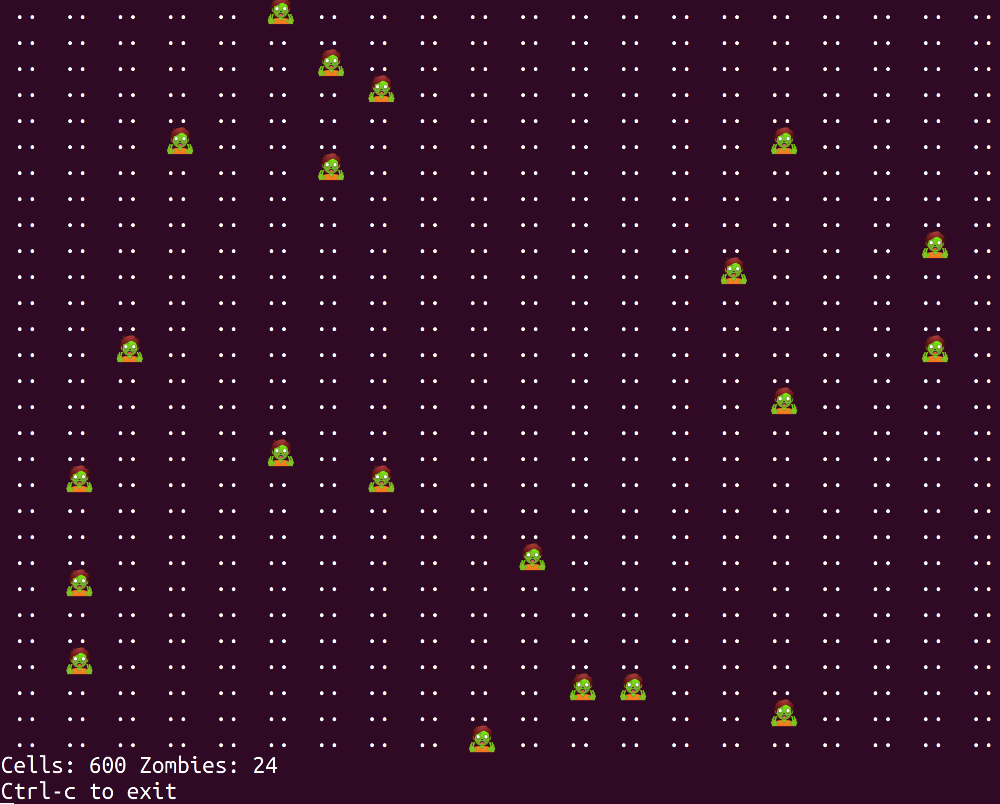
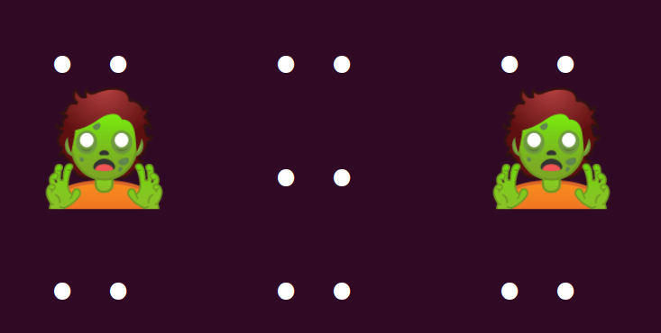
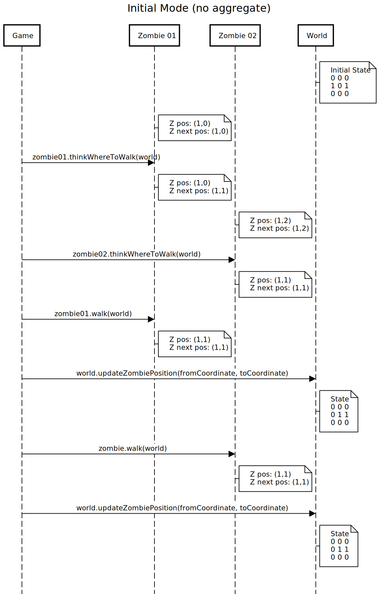

# TODO

In the apocalyptic world we have cells and zombies.



We have some domain rules:

* The world has cells.
* The world has 2 dimensions: rows and columns.
* Zombies are always located only in one cell.
* The position of a zombie if given by a coordinate which represents the row and column of the cell.
* The coordinate (0, 0) is the left top corner of the world.
* There can be only 1 zombie at the same time in a world cell.
* Zombies can move randomly around the world.
* Zombies can only move to one of the 8 adjacent cells from their current coordinate (if the new cell is empty).
* When the game starts we have a given number of zombies located in random coordinates.

The game contains the world and an array of zombies:

```javascript
class Game {
  constructor(rows, columns, initialNumberOfZombies) {
    ...
    this.world = new ApocalypticWorld(rows, columns);
    this.zombies = [];
    ...
  }
```

Eeach zombie knows its current position and the next position he wants to move to:

```javascript
class Zombie {
  constructor(coordinate) {
    this.coordinate = coordinate;
    this.nextCoordinate = coordinate;
  }
```

Zombies are a litlte bit dummy. They need time to think where they want to move and then they walk. So if you want a zombie to move you have to call two methods:

```javascript
class Zombie {
  thinkWhereToWalk(world) {
    // The zombie decide where to move
    ...
  }

  walk() {
    // The zombie updates its position
    ...
    // It returns the new position
  }
```

For this example we are going to use a 3x3 size world.



There are only 2 zombies in the world initially located at (1,0) and (1,2) cells.

The World class contains a grid with a boolean value indicating if there is a zmobie in that cell. The `World` makes sure you do not mark twice a cell as occupied by a zombie:

```javascript
class ApocalypticWorld {
  ...
  markCellAsOccupiedByAZombie(coordinate) {
    this.guardThatCellIsNotMarkedAsOccupiedTwice(coordinate);
    this.grid.setGridCellContent(coordinate, CELL_OCCUPIED);
  }
  ...
}
```

But both zombies contain their own position. We want to avoid the zombies having the same coordinate. That's the domain invariant.

We store the application state basically in two places: the world grid and in each zombie position. In order to keep consistency we have to be sure that the arrays of zombies coordinates does not contain duplicate coordiantes.

Array of zombies in memory:
```
Z01: (1,0)
Z01: (1,2)
...
```

Since JavaScript runs on a single thread we are using the function `setInterval` and we splitted the zombie coordinate change in two phases: think and walk. This was a ay to force the concurrency problems we try to solve with aggregates.

In the initial version each zombie decides to move to an empty cell (1,1) becuase is still empty. The first zombie updates its position and then the world is updated later. The second zombie updates its position sucessfully but then when it tries to update the world we get the exception becuase the cell was already occupied by the previous zombie. This is the sequence diagram:



The problem with this initial solution is we need to check again the world state before updating the zombie coordinate becuase the world state has changed. In other words, we can not update a zombie state independently without considering the world state. If we give the `Word` the responsability to update the `Zombie` state, the `World` can check if the new zombie coordinate is a valid (not empty) coordinate. The `World` would be the aggregate root.

TODO: sequence diagram with aggregate version.

## Quotes

Vaughn Vernon:
> Aggregate is synonymous with transactional consistency boundary.

>  We cannot correctly reason on aggregate design without applying transactional analysis.


